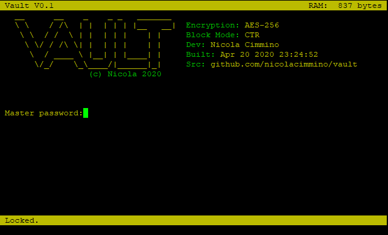
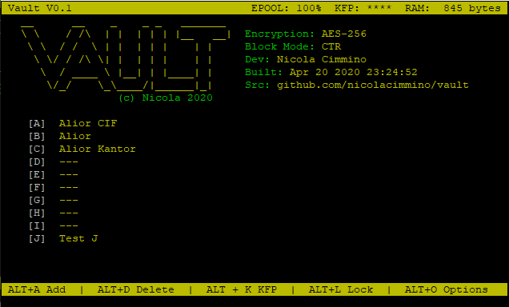
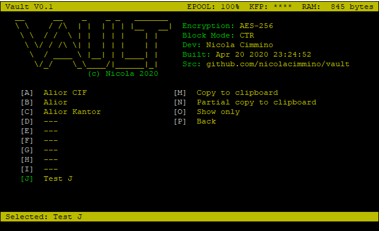
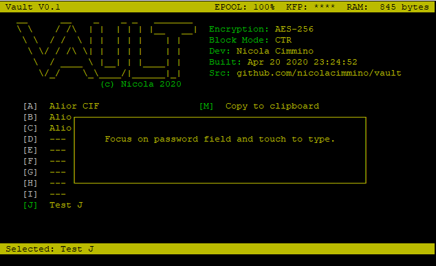
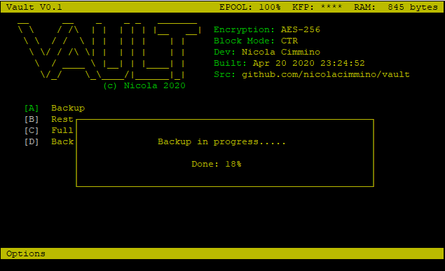

## Vault

This is a hardware vault for passwords that is cabable of typying the selected password into your browser (acting as keyboard). The interface is accessible through a VT100 style terminal.

The user needs to type a master password that will be used to derive a key for encryption/decription. 

To avoid providing an oracle, that would greately speedup brute forcing, the device accepts any password and won't error if you type one that is different than the one used for encryption. In fact, if you wish, you could use a different master password for each stored secret, as long as you remember to type the right one before retrieval. This might prove inconvenient though. If a wrong password is provided the decrypted password simply will contain random characters.

To aid the user in validating the password an RGB LED on the front will shine with a color that is the result of a 256 bytes CRC of the derived key. This is clearly not super-accurate but, in most cases, it provides a clearly different colour if there's been a typo or two in the master password. This doesn't weaken security as a potential attacker wouldn't know which colour to expect and, anyway, brute forcing all passwords to find a subset matching a certain colour would anyway be as difficult as bruteforcing in the first place.

Additionally the device provides, if the user desires so, a Key Fingerprint (KFP, on the top bar, accessiblewith `ALT+K`) which is a 4 digits checksum of the key. This allows the user to further ensure the master password was typed correctly. As long as this KFP is not written down somewhere, and is just remembered by the user, it won't increase the attack surface as the attacker wouldn't know which KFP to target for.

Once the master password is entered the user is prompted with a list of stored secrets:

Typing the corresponding letter selects the secret and opens a further sub-menu on the right side with the possible operations:

The user has a choice of:

* Retrive the full password
* Retrieve only selected characters (useful eg for certain banks logins where only some characters selected randomly are requested)
* Show the full password on screen

If one of the first two options is selected the password (or portion of) is copied into the device clipboard and is ready to be typed out.

At this point focus should be moved to the browser or application where the password is needed and the hardware button/touch button (depending on your hardware configuration touched). The password will then be typed one char at the time. There's a small delay between keystrokes as some login pages make use of JavaScript to move the cursor to different fields for each latter, without the delay these often fail to type properly.

There are menu options to add/remove passwords. The maximum capacity is of 10 secrets and each secret is maximum 64 bytes. 

NOTE: The secret name is not encrypted so you will see the correct labels even if the master password is wrong.

Additionally the device allows to backup and restore the full content of its encrypted data. This is a convenient way to store a backup somewhere, but also to make several copies of the same vault. Once the user enters the backup mode, they will need to focus on a notepad and press the button.

